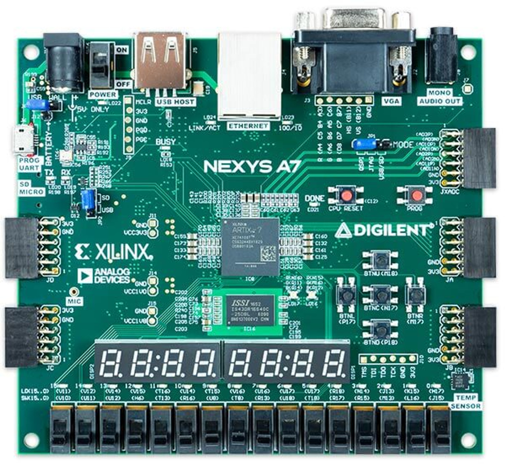

# VHDL Code for FPGAs (With Some Verilog For Comparison)

This is a collection of code from CDA 4240C: Design of Digital Systems.

 - There is a separate Verilog folder since we studied the differences between it and VHDL at the end of the course.

 - My Projects were simulated and synthesized using [Xilinx Vivado 2022.2](https://www.xilinx.com/support/download.html)

 - This code runs on the [Nexys A7-100T](https://digilent.com/shop/nexys-a7-fpga-trainer-board-recommended-for-ece-curriculum/) FPGA Evaluation Board:

  

 

<small>
    <a href="https://digilent.com/shop/nexys-a7-fpga-trainer-board-recommended-for-ece-curriculum/">
        Image Source
    </a>
</small>

## Status:

